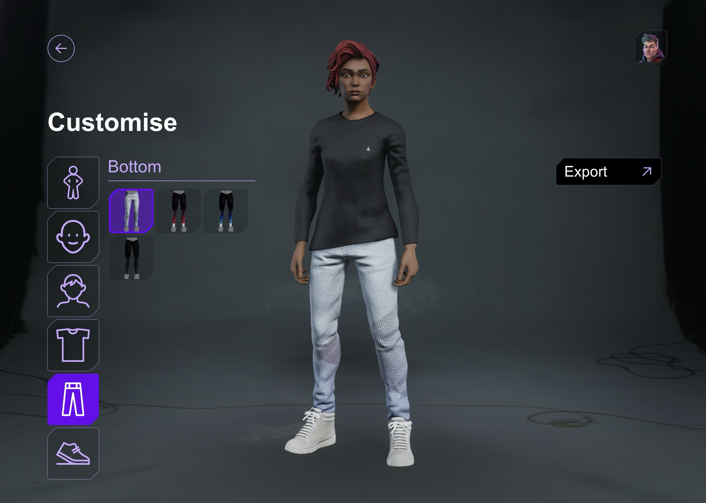

# Avatar Creator

This repo contains:

* [`packages/avatar-creator`](packages/avatar-creator) – a React component library that lets users build fully-rigged 3D avatars powered by the [PlayCanvas](https://playcanvas.com) engine.
* [`examples/avatar-preview-app`](examples/avatar-preview-app) – a minimal Next.js application that embeds the Avatar Creator and serves as a live playground / reference integration.



## TODO:
* [ ] Make UI more composable as part of a wider application (e.g. not assuming fullscreen)
* [ ] Add API for loading and saving avatar configurations
* [ ] Update data model to allow more flexibility for custom part combinations
* [ ] Publish the avatar-creator library to npm

---

## Getting Started

1. **Install dependencies (workspace-wide)**

   ```bash
   nvm use # otherwise use Node.js v22.x
   npm install
   ```

2. **Set up Git LFS for large assets**

   This project uses Git LFS to manage large 3D model files (.glb) and image assets (.webp). Make sure you have Git LFS installed and set up:

   ```bash
   # Install Git LFS (if not already installed)
   # On macOS with Homebrew:
   brew install git-lfs
   
   # On other systems, see: https://git-lfs.github.io/
   
   # Initialize Git LFS in the repository
   git lfs install
   
   # Pull the large files
   git lfs pull
   ```

3. **Start the development servers**

   ```bash
   npm run iterate # or `npm run dev`
   ```

   This will:
   * build `packages/avatar-creator` in watch-mode
   * launch the Next.js preview app on <http://localhost:3000>

   Open http://localhost:3000 in your browser – you should see the Avatar Creator embedded in the preview site.

> 💡  Prefer to run packages individually?
>
> ```bash
> # in one terminal – build the library and serve static assets
> cd packages/avatar-creator && npm run iterate
>
> # in another terminal – start the preview app
> cd examples/avatar-preview-app && npm run iterate
> ```

---

## Production Builds

```bash
# build everything
npm run build

# preview the Next.js production build
cd examples/avatar-preview-app && npm run start
```

The library is compiled to ESM bundles (and type declarations) under `packages/avatar-creator/build/`.

---

## Data Structure

See [examples/avatar-preview-app/public/data.json](examples/avatar-preview-app/public/data.json)

This specific project implements a static JSON data containing multiple body types, skin colors and various slot models: `body`, `head`, `hair`, `top`, `bottom`, `shoes`

All URLs are defined without an extension, as it will be added: `.glb` (for 3D rendering) and `.webp` (for thumbnail).

**Body** - is a custom slot, that is skin dependant. And will be loaded automatically based on other slots.

**Head** - has a skin dependency, means in data only a single url is defined, but URL will be modified with added `_xx` skin index.

**Top** - can have `secondary` property, which will add an additional GLB for that slot. AvatarLoader will load it as `top:secondary`. If slot has `torso:true`, then torso will be when this slot is loaded - this is common for shirts, while e.g. Hoodie covers whole torso so by default it will not be rendering torso.

**Bottom** - can have `secondary` the same way as `top` slot, and optional property `legs:true`, if set to true, then legs will be rendered also. This is common for shorts for example. By default legs will not be rendered.

**Shoes** - is a most simple slot.

--- 

## How to make new assets

For production of assets, there a few recommendations and guidelines as well as templates to follow:

* [Clothes](./docs/clothes.md)
* *TODO* - Faces
* *TODO* - Hair

---

## License

The contents of this repository is MIT Licensed. 

Any referenced avatar assets not otherwise explicitly licensed are property of their respective owners. All rights reserved.
